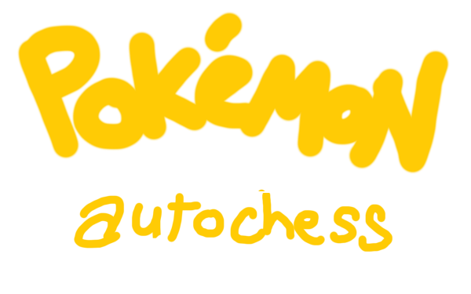

An autochess game themed after Pokemon.

Play at https://henry-alakazhang.github.io/pokemon-autochess

I don't own the concept of Pokemon, the sprites, or anything else related to Pokemon. Those belong to GameFreak, The Pokemon Company and Nintendo. I'm well aware such disclaimers don't really mean anything, but oh well.

- Gen 1-5 sprites owned by GameFreak, The Pokemon Company and/or Nintendo
 - Landorus Therian sprite credit to [spritesstealer](https://www.deviantart.com/spritesstealer/art/pokemon-b2-w2-kami-trio-therian-form-overworld-339341145), with small modifications by me
- Gen 6 sprites credit to [princess-phoenix](https://www.deviantart.com/princess-phoenix/art/Gen-6-Kalos-Pokemon-Overworld-Sprites-525954409).
- Gen 7 sprites credit to [larryturbo, princess-phoenix, kidkatt, Zender1752 and SageDeoxys](https://www.deviantart.com/larryturbo/art/Gen-7-Alola-Overworld-Sprites-805455576)
- Gen 8 sprites credit to [SageDeoxys](https://www.deviantart.com/sagedeoxys/art/ZIP-Pokemon-Gen-8-Overworld-Spritesheets-by-Sage-827405664)

## Running the game

Clone the repo

Install Node -> https://nodejs.org/en/    
Install Yarn -> https://yarnpkg.com/en/docs/install    

`yarn` to install dependencies    
`yarn start` to start the local dev server    
Visit `localhost:8080` to access the game    

## Contributing
There's a trello board here with all the stuff I'm planning: https://trello.com/b/ncSePCMD/pokemon-autochess
Feel free to create an issue, then a PR if you want to add some code. There's a `standalone` tag for good tasks that aren't dependent on anything else.

## Game Design Resources
https://drive.google.com/open?id=136L8KTz_NVKMUWZYl-B14twMeDyIot6p
